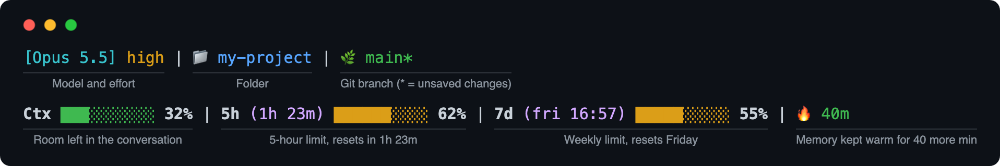
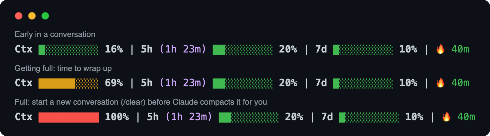
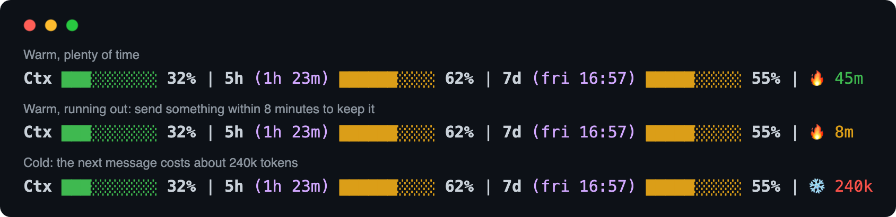
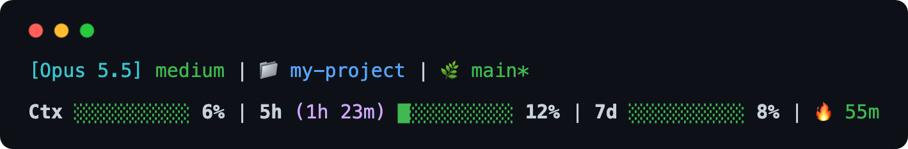
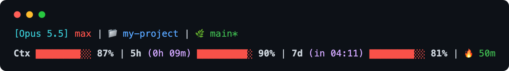

# claude-statusline

A status line for Claude Code that shows, at a glance, how much room you have left: in the conversation, in your usage limits, and in Claude's short-term memory.



> **Terminal only.** This is for [Claude Code](https://docs.claude.com/en/docs/claude-code/overview), the version of Claude you run in a terminal window. It does not appear in the Claude app on your computer, in the browser, or on your phone.

## Reading it

**The colours mean the same thing everywhere.** Green is fine. Yellow means keep an eye on it. Red means it's about to get in your way.

### Top line: where you are

- **Model and effort.** `[Opus 5.5]` is the model you're talking to. The word after it is how hard Claude thinks before answering. Higher effort gives better answers on hard problems but uses up your limits faster, so it's coloured the same way: `low` and `medium` are green, `high` is yellow, and `xhigh` and `max` are red.
- **📁 Folder.** The folder Claude is working in.
- **🌿 Git branch.** Shown only if the folder is a git project. A `*` after the name means there are changes that haven't been committed yet.

### Bottom line: how much room is left

#### Ctx: the conversation

How full the current conversation is. Claude can only hold so much text at once. When it gets too full, Claude Code **compacts** the conversation automatically: it replaces the whole thing with a summary and carries on. That often happens in the middle of a task, and details get lost in the summary.

**So this bar says 100 % a little *before* that point**, not at the model's actual limit. When it's full you still have room to finish what you're doing and start a fresh conversation yourself (type `/clear`), instead of being cut off halfway.



For the curious: on a model that holds a million tokens, compaction kicks in at about 967,000, and this bar reads 100 % at 917,000. [How it's calculated](docs/HOW-IT-WORKS.md#the-context-bar).

#### 5h: your five-hour limit

Claude subscriptions limit how much you can use in any five-hour period. The bar shows how much of it you've used, and the purple time in brackets is **how long until it resets**, so `(1h 23m)` means an hour and twenty-three minutes from now.

#### 7d: your weekly limit

The same idea over seven days. The reset time only appears when it's worth knowing: when there are less than two days left, or when you've used half the week's allowance. It shows a day and time, like `(fri 16:57)`, and switches to a countdown, like `(in 04:11)`, in the last twelve hours.

The 5h and 7d bars only appear on a Claude subscription (Pro or Max), and only after your first message in a session.

#### 🔥 and ❄️: Claude's short-term memory

After each message, Claude keeps your conversation ready in memory for a while (usually an hour). That's the **cache**. While it's warm, continuing the conversation is cheap. Every message you send restarts the timer.

- **🔥 45m** means the cache is warm and will stay that way for 45 more minutes. It turns yellow when there's less than a quarter of an hour left.
- **❄️ 240k** means it has gone cold. Your next message has to send the whole conversation again, which uses a lot more of your limits. The number is roughly how much, measured in tokens (pieces of text).



**What to do with this:** if you see ❄️ with a big number, you're coming back to a long conversation after a break. If you don't need everything in it, start fresh with `/clear` instead. It costs almost nothing.

### What it looks like in practice

A quiet start: everything green.



A long, heavy session, close to every limit:



## Installing it

It works on macOS and Linux. It hasn't been tested on Windows.

### The easy way: let Claude do it

Open Claude Code in a terminal and paste this in:

```text
Install the status line from https://github.com/Gjermstad/claude-statusline.
Download statusline.sh to ~/.claude/statusline.sh, make it executable, and set it
as my statusLine in ~/.claude/settings.json with refreshInterval 60. Keep my other
settings. It needs jq, so check that I have it first.
```

Claude will ask for permission before each step. The status line appears below the box where you type once it's done. If it doesn't show up, quit Claude Code and start it again.

### By hand

1. Make sure you have `jq`: type `jq --version` in a terminal. Recent versions of macOS already include it. If yours doesn't, install it with `brew install jq` (macOS) or `sudo apt install jq` (Ubuntu/Debian).
2. Download the script:
   ```sh
   curl -o ~/.claude/statusline.sh https://raw.githubusercontent.com/Gjermstad/claude-statusline/main/statusline.sh
   chmod +x ~/.claude/statusline.sh
   ```
3. Open `~/.claude/settings.json` (create it if it doesn't exist) and add:
   ```json
   {
     "statusLine": {
       "type": "command",
       "command": "~/.claude/statusline.sh",
       "refreshInterval": 60
     }
   }
   ```
   If the file already has settings in it, add the `"statusLine"` part next to them rather than replacing the file.

`refreshInterval` redraws the line every 60 seconds, so the countdowns keep ticking while you're away.

### Removing it

Delete the `"statusLine"` part from `~/.claude/settings.json`, or ask Claude to do it.

## More

- [How it works](docs/HOW-IT-WORKS.md): the calculations, the settings you can change, and how the screenshots are made.
- MIT licence: use it, change it, share it.
